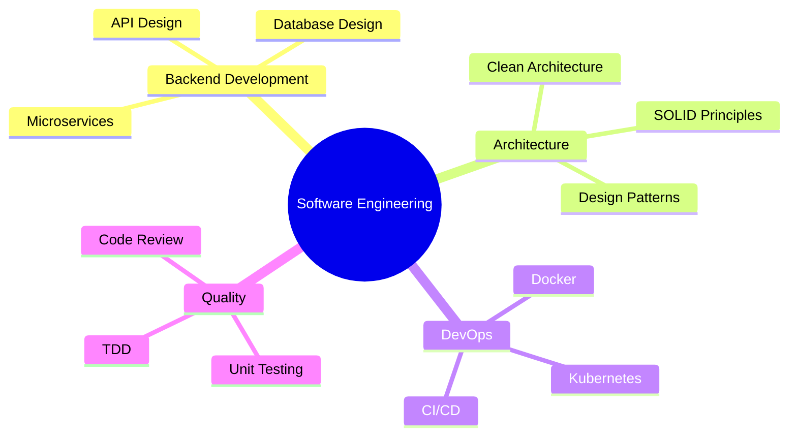

# 👨‍💻 Ömer Faruk KARACA

<div align="center">
  
</div>

<div align="center">
  
</div>

---

## 🚀 **Hakkımda**

```typescript
const omerFarukKaraca = {
    title: "Software Engineer",
    location: "İstanbul, Türkiye 🇹🇷",
    company: "Metro İstanbul",
    experience: "4+ years",
    focus: ["Backend Development", "Microservices", "Clean Architecture"],
    currentlyLearning: ["Go", "Kubernetes", "Cloud Native Technologies"],
    askMeAbout: ["C#", "Node.js", "PostgreSQL", "Microservices", "TDD"],
    funFact: "Karmaşık problemleri çözmeyi ve temiz kod yazmayı seviyorum! 🎯"
};
```

---

## 🛠️ **Teknoloji Stack'im**

<div align="center">

### **💻 Programlama Dilleri**
<p>
  
</p>

### **🚀 Framework & Kütüphaneler**
<p>
  
  
  
</p>

### **🗄️ Veritabanları**
<p>
  
  
  
</p>

### **☁️ DevOps & Cloud**
<p>
  
  
</p>

### **🔧 Araçlar & IDE**
<p>
  
</p>

</div>

---

## 📊 **GitHub Analytics**

<div align="center">
  
  
</div>

<div align="center">
  
</div>

<div align="center">
  
</div>

---

## 🏆 **GitHub Ödüllerim**

<div align="center">
  
</div>

---

## 💼 **Profesyonel Deneyim**

<div align="center">
  
| 🏢 **Şirket** | 👨‍💼 **Pozisyon** | 📅 **Süre** | 🛠️ **Teknolojiler** |
|:---:|:---:|:---:|:---:|
| **Metro İstanbul** | Software Engineer | 2023 - Günümüz | C#, .NET Core, PostgreSQL, Docker |
| **İdea Teknoloji** | Software Engineer | 2021 - 2023 | Node.js, MongoDB, Redis, AWS |

</div>

---

## 🎯 **Uzmanlaştığım Alanlar**

<div align="center">



</div>


---

## 🌐 **Benimle İletişime Geçin**

<div align="center">
  <a href="https://www.linkedin.com/in/ofkrc" target="_blank">
    
  </a>
  <a href="mailto:ofkrc@outlook.com">
    
  </a>
  <a href="https://github.com/ofkrc" target="_blank">
    
  </a>
</div>

---

<div align="center">
  
</div>

<div align="center">
  
  
</div>

<div align="center">
  <h3>💫 "Kod yazmak sanat, çözmek bilim!" 💫</h3>
  
</div>
